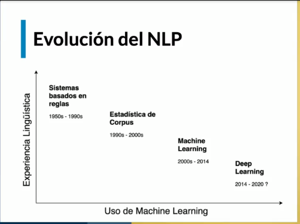

# Curso de Fundamentos de Procesamiento de Lenguaje Natural con Python y NLTK

## Introducción al Procesamiento de Lenguaje Natural

NLP como el camino hacia el ideal de la IA

Natural Language Processing (NLP)

Natural Language Understanding (NLU)

### NLP

es un area que combina ciencias de la computacion, linguistica , inteligencia artificial y lenguages de programacion
para entender como hacer interacciones entre usuario y maquinas a traves del lenguaje natural que usamos los seres humanos para comunicarnos

dentro del area de NLP existe el area de NLU. Que se encarga de tareas especificas que las maquinas puedan ejecutar en la cual se demuestre que el robot no solo procesa el lenguaje sino que tambien lo puede entender.

**Test de turing** "Si un humano no puede distinguir entre una maquina y otra persona en una conversacion, entonces esa maquina a alcanzado un nivel de inteligencia comparable al humano"

Usos actulaes del NLP

- Máquinas de búsqueda
- Traduccion de texto
- Chatbots
- Análisis de discurso
- Reconocimiento del habla
- Etc...

### ¿Por qué es tan difícil?

Ejemplo texto:

"Busco gente para trabajar entre 18 y 30 años"
un ser humano entiende que busca gente entre ese rango de edad

para un algoritmo de NLP puede interpretar que busca gente para trabajar por un periodo de tiempo de entre 18 y 30 años

NLP es dificil porque
el lenguaje humano es difuso, ambiguo y requiere de mucho contexto.

## Evolución del NLP

**Sistemas basados en reglas** Eran reglas hechas a mano basandose en nuestro entendimiento del lenguage

**Estadística de Corpus** Un corpus es una coleccion de textos que se usan para entrenar un algoritmo que aprende de probabilidad de las palabras

**Machine Learning** Algoritmos entrenados a partir de texto

**Deep learning** Algoritmos entrenados a partir de texto que aprenden de los patrones de texto.

Ejemplo del uso del lenguage del por cual los algoritmos de NLP, a pesar de lo que hacen **No entienden** el lenguage

El trofeo no cabe en la caja porque es muy grande

El trofeo no cabe en la caja porque es muy pequeña

### Aportes alumnos

[Un recurso para entender ESTADÍSTICA DE LOS CORPUS TEXTUALES](http://www.scielo.edu.uy/scielo.php?script=sci_arttext&pid=S2079-312X2017000100121)

## Conceptos básicos de NLP

Veremos estructuras básicas del lenguaje humano.

[Manning & Schütze (1999), Foundations of Statistical, Natural Language Processing](https://libgen.lc/ads.php?md5=e0fd4c5eae1bfbb749661e8d043656a3)

**NLP**: El procesamiento de lenguaje natural esta más enfocado hacia aplicaciones practicas en la ingeniería

**LC** : La lingüística computacional estudia el lenguaje desde una perspectiva más científica. (Basada en crear modelos que pueden tener dos enfoques de conocimiento o datos). Tiene dos enfoques:

- Enfoque basado conocimiento
- Enfoque basado en datos

El procesamiento de una cadena de texto, el proceso de procesamiento de texto consiste en realizar una **Normalización** del texto que incluye los siguientes procesos:

- Tokenización: Separar en palabras toda la cadena de texto, separa las palabras en tokens o unidades minimas linguisticas las cuales ser cada una de sus palabras.

- Lematización: Convertir cada una de las palabras o tokens o frases de una cadena de texto a su **raiz fundamental**, en el caso de un verbo seria transformarlo a su forma sin conjugar dejandolo en infinitivo.

- Segmentación: Separación en frases, puede ser en base las comas pero no siempre se aplica esto y no es tan sencillo.

Funel basico de procesamiento de texto lo cual es la Nomalización de texto.

Este proceso anterior, queremos aplicarlo a muchas cadenas de texto, el cual llamamos corpus. Un conjunto de corpus se llama corpora.

**CORPUS**: Colección de muchos textos

**CORPORA**: Colección de CORPUS, Colección de de collecciones de textos

## Configurar ambiente de trabajo

